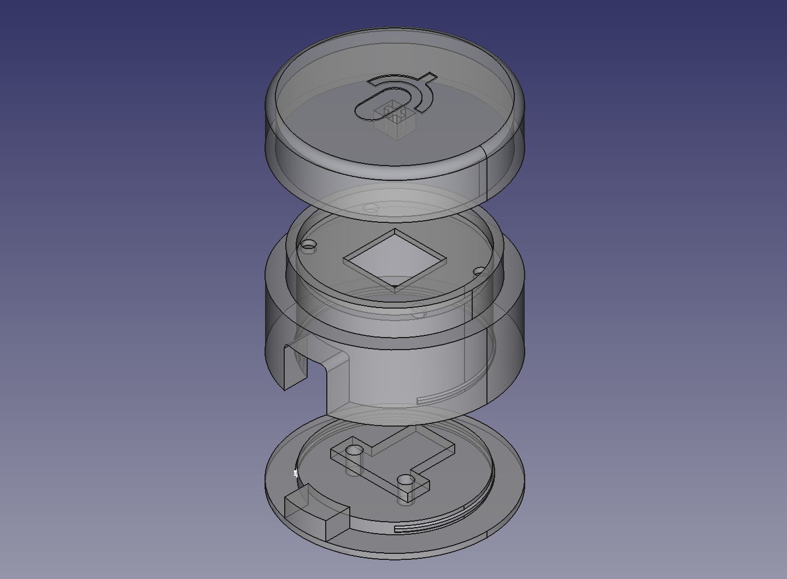

# Muut Button case
[![CC BY-SA 4.0][cc-by-sa-shield]][cc-by-sa]

## Overview

## Requirements

* A 3D printer
* 2x [M2 threaded inserts](https://turmberg3d.de/products/gewindeeinsatze-fur-kunststoffteile?variant=39376894001347)
* 2x M2x4 screws
* Optional: Foam rubber pad, round

## License

This work is licensed under a
[Creative Commons Attribution-ShareAlike 4.0 International License][cc-by-sa].

[![CC BY-SA 4.0][cc-by-sa-image]][cc-by-sa]

[cc-by-sa]: http://creativecommons.org/licenses/by-sa/4.0/
[cc-by-sa-image]: https://licensebuttons.net/l/by-sa/4.0/88x31.png
[cc-by-sa-shield]: https://img.shields.io/badge/License-CC%20BY--SA%204.0-lightgrey.svg
